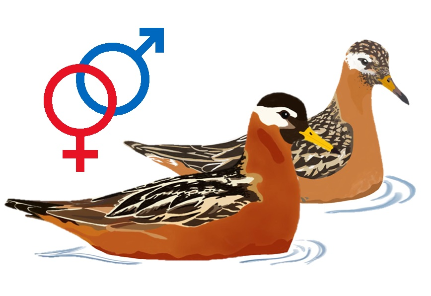

# **Data and code from:**

### Mutual mate guarding and limited sexual conflict in a sex-role reversed shorebird

  

  

A pair of red phalaropes (<i>Phalaropus fulicarius</i>). Illustration by Margherita Cragnolini.

### **Description**

This repository contains all data and code used for data analysis and figure production in *Mutual mate guarding and limited sexual conflict in a sex-role reversed shorebird* by 
Johannes Krietsch , 
Mihai Valcu 
Margherita Cragnolini, 
Wolfgang Forstmeier  and 
Bart Kempenaers .  
  
When using the data or code please cite the associated manuscript (in review) and [Open Science Framework repository](add link) (which is synchronized with this repository). Please do not hesitate to contact me (j.krietsch@orn.mpg.de) if you have any questions, trouble running the code, found bugs or ideas to develop the project further. 

&nbsp;

### **Repository Contents**

**`DATA/`**:

All data used in this analysis (**click on the black arrows** to see column definitions). Extracted from our database (see below).

  
 <b><code>CAPTURES</code></b> – A table of all captures data

  
  Columns are defined as:

  1.	`year_`: year
  2.	`ID`: metal band id
  3.	`UL`: upper left colour bands
  4.	`UR`: upper right colour bands
  5.	`LL`: lower left colour bands
  6.	`LR`: lower right colour bands
  7.  `gps_tagID`: id of the GPS tag 
  8.	`sex`: field and genetic sex (F = female & M = male)
  9.  `lat`: capture location latitude (decimal degrees)
  10. `lon`: capture location longitude (decimal degrees)
  11. `caught_time`: date and time caught
  12. `dead`: bird was found dead = 1 or was caught alive = 0

  
 <b><code>NESTS</code></b> – A table of all nests data

  
  Columns are defined as:

  1.	`data_type`: data types (see methods)
  2.	`year_`: year
  3.	`nestID`: unique nest id
  4.	`male_id`: male metal band id
  5.	`female_id`: female metal band id
  6.	`male_assigned`: how the male was assigned: 0 = not, 1 = field, 2 = genetically, 3 = only GPStag
  7.	`female_assigned`: how the female was assigned: 0 = not, 1 = field, 2 = genetically, 3 = only GPStag
  8.	`found_datetime`: date and time the nest was found
  9.  `clutch_size`: total clutch size
  10. `initiation`: estimated date and time the first egg was laid
  11. `initiation_method`: method with which the initiation date was estimated
  12. `egg1`: estimated lay date of the first egg
  13. `egg2`: estimated lay date of the second egg
  14. `egg3`: estimated lay date of the third egg  
  15. `egg4`: estimated lay date of the forth egg  
  16. `hatching_datetime`: method with which the hatching date was estimated
  17. `nest_state`: last nest state: I = Incubated (active  nest), P = Predated, D = Deserted, H = Hatched (received hatched chicks), 
                    U = Unknown, O = Observer (collected withour replacement)     
  18. `nest_state_date`: date and time the nest state was based on 
  19. `lat`: nest location latitude (decimal degrees)
  20. `lon`: nest location longitude (decimal degrees)
  21. `parentage`: logic if parentage was possible     
  22. `anyEPY`: logic if any extra-pair young were found in the clutch
  23. `N_parentage`: number of eggs with parentage data
  24. `N_EPY`: number of extra-pair young
  25. `female_clutch`: sequence of female clutches based on the initiation date (1st, 2nd or 3rd clutch) within season
  26. `N_female_clutch`: total number of clutches within season
  27. `polyandrous`: logic if the female was social polyandrous
  28. `male_clutch`: sequence of male clutches based on the initiation date (1st or 2nd clutch) within season   
  29. `N_male_clutch`: total number of clutches within season     
  30. `clutch_together`: sequence of pairwise clutches based on the initiation date (1st or 2nd clutch) within season   
  31. `renesting_male`: logic if the male was renesting
  32. `m_tagged`: logic if the male was equipped with a GPS tag
  33. `f_tagged`: logic if the female was equipped with a GPS tag

  
 <b><code>OBSERVATIONS</code></b> – A table of all observations data

  
  Columns are defined as:

  1.	`year_`: year 
  2.	`datetime_`: date and time of the observation
  3.	`obs_id`: unique observation id
  4.	`ID`: metal band id
  5.	`UL`: upper left colour bands
  6.	`UR`: upper right colour bands
  7.	`LL`: lower left colour bands
  8.	`LR`: lower right colour bands
  9.	`sex`: field and genetic sex (F = female & M = male)
  10. `lat`: nest location latitude (decimal degrees)
  11. `lon`: nest location longitude (decimal degrees)
  12.	`study_site`: logic if observation was within the intensive study site 
  13.	`habitat`: habitat the bird was in (W = water, G = ground)
  14.	`aggres`: type of aggression D = Displacement/Chase, F = Fight, B = Beak Pointing, O = Other (see comments) 
                and 0 = Receiver or 1 = Initiator (e.g. focal is initiating F) or nothing (if not identified)
  15.	`displ`: type of display: K = Kissing, P = Parallel Swim, F = Flapping and  0 = Receiver (e.g. F0) or 
                1 = Initiator (e.g. focal is initiating P) or nothing (if not identified)
  16.	`cop`: Copulation: S = Successful copulation, A = Attempted copulation + 0 = Receiver or 
             1 = Initiator/Invitation (e.g. focal is inviting male to copulate) or nothing (if not identified)
  17.	`cop_inv`:  copulation with invitation: 1 = focal invited (presented tail), 0 = Copulation without invitation  
  18.	`flight`: Flight: F = Flight, C = Chase, CF = Circle Flight + 0 = Receiver or 1 = Initiator 
                (e.g. focal is chasing, displaying, etc.) or nothing (if not identified)
  19.	`voc`:  did the birds vocalize: Y=Yes, N=No (textual description in comments if unusual)
  20.	`maint`: Maintenance behaviour (comma separated & without space): F = Foraging, R = Resting, P = Preening, 
               A = Alarming, BW = Distraction Display (e.g. Broken Wing)
  21.	`spin`: spinning during foraging on water: C = Clockwise (right), AC = Anti-Clockwise (left), B = Both
  22.	`comments`: comments

  
 <b><code>NANO_TAGS</code></b> – A table of all GPS (Nano tag) data

  
  Columns are defined as:

  1.	`year_`: year
  2.	`tagID`: id of the GPS tag 
  3.	`ID`: metal band id
  4.	`sex`: field and genetic sex (F = female & M = male)
  5.	`datetime_`: date and time of the GPS fix
  6.	`lat`: latitude (decimal degrees)
  7.	`lon`: longitude (decimal degrees)
  8.	`gps_speed`: as measured by the tag (m/s)
  9.	`altitude`: comment from the parentage analysis
  10. `batvolt`: voltage of the battery
  11.	`filtered`: logic if the data passed the filtering procedure (see Methods section in manuscript)

&nbsp;

**`R/`**:

   - [`7_figures_and_statistic.R`](https://github.com/krietsch/REPH_PAIRS/blob/master/R/2_R_script_data_anaylsis.R). 
  The main script to reproduce all figures and statistic of this project. It contains a detailed commented workflow and 
  follows the order in the manuscript.
  ([View compiled](https://raw.githack.com/krietsch/REPH_PAIRS/master/OUTPUTS/R_COMPILED/7_figures_and_statistic.html "html"))
  
  - [`0_functions.R`](https://github.com/krietsch/REPH_PAIRS/blob/master/R/0_functions.R) The workflow script 
  sources this script, which is only needed to create a base map using OpenStreetMap data stored in the R package 
  [`auksRuak`](https://github.com/krietsch/auksRuak). 
  
  - [`0_extract_data_from_database.R`](https://github.com/krietsch/REPH_PAIRS/blob/master/R/0_extract_data_from_database.R) 
  Script used to extract the data from our database. This script can only be run with access 
  to our database and is only stored to document the process. 
  
  - [`1_tag_accuracy.R`](https://github.com/krietsch/REPH_PAIRS/blob/master/R/1_tag_accuracy.R) 
  Describes how I calculated the accuracy of the tags using data from a known location on the ground and actually on a bird. 
  ([View compiled](https://raw.githack.com/krietsch/REPH_PAIRS/master/OUTPUTS/R_COMPILED/1_tag_accuracy.html "html"))

  - [`2_filter_GPS_data.R`](https://github.com/krietsch/REPH_PAIRS/blob/master/R/2_filter_GPS_data.R) 
  The procedure of how I filtered the data. 
  ([View compiled](https://raw.githack.com/krietsch/REPH_PAIRS/master/OUTPUTS/R_COMPILED/2_filter_GPS_data.html "html"))

  - [`3_spatio_temporal_distance.R`](https://github.com/krietsch/REPH_PAIRS/blob/master/R/3_spatio_temporal_distance.R) 
  Calculating the distance between points. 
  ([View compiled](https://raw.githack.com/krietsch/REPH_PAIRS/master/OUTPUTS/R_COMPILED/3_spatio_temporal_distance.html "html"))  
  
  - [`4_interaction_method.R`](https://github.com/krietsch/REPH_PAIRS/blob/master/R/4_interaction_method.R) 
  Testing different methods and thresholds.
  ([View compiled](https://raw.githack.com/krietsch/REPH_PAIRS/master/OUTPUTS/R_COMPILED/4_interaction_method.html "html"))
  
  - [`5_pair_wise_interactions.R`](https://github.com/krietsch/REPH_PAIRS/blob/master/R/5_pair_wise_interactions.R) 
  Using the final decided method to define when birds were together. See manuscript for detailed description. 
  ([View compiled](https://raw.githack.com/krietsch/REPH_PAIRS/master/OUTPUTS/R_COMPILED/5_pair_wise_interactions.html "html"))
  
  - [`6_subset_breeders.R`](https://github.com/krietsch/REPH_PAIRS/blob/master/R/6_subset_breeders.R) 
  Subset all relevant data for further analysis and bind with nest information. 
  ([View compiled](https://raw.githack.com/krietsch/REPH_PAIRS/master/OUTPUTS/R_COMPILED/6_subset_breeders.html "html"))  
  
  - [`8_animation_data.R`](https://github.com/krietsch/REPH_PAIRS/blob/master/R/8_animation_data.R) 
  Prepare data for scripts creating example animations of tracks.
  
  - [`8_animation_R220_19.R`](https://github.com/krietsch/REPH_PAIRS/blob/master/R/8_animation_R220_19.R) 
  Create example animation of nest R220_19.

  - [`8_animation_R304_18.R`](https://github.com/krietsch/REPH_PAIRS/blob/master/R/8_animation_R304_18.R) 
  Create example animation of nest R304_18.
  
  - [`8_animation_R913_19.R`](https://github.com/krietsch/REPH_PAIRS/blob/master/R/8_animation_R913_19.R) 
  Create example animation of nest R913_19.
   
  

&nbsp;

  
**`OUTPUTS/`**:

  - `FIGURES/` – Contains all figures created for publication
  
  - `ESM/` – Contains all supplementary tables created for publication
  
  - `R_COMPILED/` – Contains all compiled html flies describing the whole workflow 
  
  - `INSPECTION/` – Contains all figures created to check the filtering of the data

&nbsp;

### **Terms of Use**

The data and code are supplied for scientific analysis, research, teaching or conservation purposes and shall be used only in accordance with the [GNU GPLv3](https://github.com/krietsch/REPH_PATERNITY/blob/master/LICENSE) license.
For any publication making substantial use of the data or code, the authors welcome the opportunity for collaboration and to comment prior to publication. Please reach out to me (j.krietsch@orn.mpg.de) or Bart Kempenaers (b.kempenaers@orn.mpg.de).

If you use the code or data, please cite the OSF repository linked to this github project: 

Krietsch, J., Valcu, M., Cragnolini, M., Wolfgang Forstmeier & Kempenaers, B. (2023). Data and code from ‘Mutual mate guarding and limited sexual conflict in a sex-role reversed shorebird’. Open Science Framework. https://doi.org/10.17605/OSF.IO/BW94C

and the corresponding article:

Krietsch, J., Valcu, M., Cragnolini, M., Wolfgang Forstmeier & Kempenaers, B. (2023). Mutual mate guarding and limited sexual conflict in a sex-role reversed shorebird. submitted manuscript.

&nbsp;

### **Acknowledgments**

This work was funded by the [Max Planck Society](https://www.mpg.de/en) (to B.K.). J.K. was supported by the International Max Planck Research School for Organismal Biology. 

We thank Kristina Beck, Eunbi Kwon, Pietro D'Amelio, Giulia Bambini, Peter Santema, Fenja Squirrell, Alice Pintaric, Carol Gilsenan, Anne Cillard, Kim Teltscher, Martin Bulla, Andrea Wittenzellner, Luisana Carballo, Sylvia Kuhn and Sabine Spehn for help in the field (ordered by days in the field), and Emmi Schlicht, Eunbi Kwon, Martin Bulla and Anne Aulsebrook for discussions. We also thank Richard B. Lanctot for always helping out with advice, logistics, permits and equipment, the state and federal committees that reviewed and approved permits for this study, and the Ukpeaġvik Iñupiat Corporation for logistic support and access to their lands. 

&nbsp;

  
     

